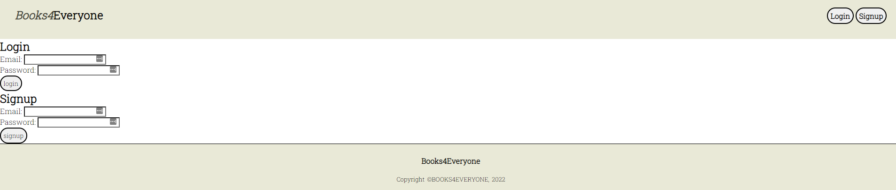

# Books4Everyone


## Table of contents

[Description](#description)

[Links](#links)

[User Story](#user-story)

[Acceptance Criteria](#acceptance-criteria)

[Future Developments](#future-developments)

[Screenshots](#screenshots)


## Description
An application that allows registered users to browse through a book database, to view different genres, books available in that genre and details like published year, author, number of pages, rating and number of people who rated for each book. Users also has an option to add books to their own reading list. 


## Links
[GitHub Repo](https://github.com/andresparraarze/pejisaurio2000.git)

[Deployed Application](https://limitless-river-58971.herokuapp.com/)


## User Story
```
AS A book lover who wants to find information about books and keep track of my reading list
I WANT a website that allows me to do so
SO THAT I have a way to find and keep up with my personal reading list
```


## Acceptance Criteria
```
GIVEN a responsive website to keep track of books
WHEN I click on the link to the website
THEN I am greeted with genres list
WHEN I click on anyting on homepage 
THEN I am asked to login or signup and presented with those forms
WHEN I click on the signup button in signup form
THEN I new credentials are created and am redirected to homepage if credentials are valid
WHEN I click on the login button in login form
THEN I am redirected to homepage if credentials are correct
WHEN I click on a genre
THEN I am shown breif of books availablein that genre
WhEN I click on a book
THEN I am presented with more details on that book
WHEN I click on the "Add to reading list" button on any page
THEN I can save the book to my own personal reading list
```


## Future Developments

* Review functionality
* Links to reading platforms to actual read the books online
* Importing books database from APIs, so that it is more detailed and has a lot more books


## Screenshots





